# Derma AI - AI-Powered Skin Disease Detection

Derma AI is a full-stack web application designed to assist in the preliminary identification of common skin diseases. Leveraging a powerful deep learning model, it analyzes user-uploaded images to provide a potential classification, alongside a suite of features including user authentication, doctor locator, and informational blogs.

---

## Features

* **AI-Powered Detection**: Utilizes a highly accurate Machine Learning model to classify 8 different types of skin diseases from images.
* **Secure User Authentication**: Complete user management system with signup, login, and email verification.
* **Interactive Dashboard**: A user-friendly dashboard to manage profile and view detection history.
* **Find a Doctor**: An integrated feature to help users find dermatologists near them.
* **Informational Blog**: A content section with articles and information about skin health.
* **Full-Stack Architecture**: Built with a modern tech stack featuring a React frontend and a FastAPI backend.

---

## Model, Accuracy & Dataset

The core of this project is a Convolutional Neural Network (CNN) fine-tuned for skin disease classification.

* **Model**: `MobileNet_V2`
* **Accuracy**: Achieved **96%+** accuracy on the test dataset.
* **Dataset**: The model was trained on the "Skin Disease Dataset" available on Kaggle. You can find it here:
    * [https://www.kaggle.com/datasets/subirbiswas19/skin-disease-dataset](https://www.kaggle.com/datasets/subirbiswas19/skin-disease-dataset)
* **Detected Diseases**: The model is trained to identify the following 8 conditions:
    1.  **Bacterial**: Cellulitis, Impetigo
    2.  **Fungal**: Athlete's Foot, Nail Fungus, Ringworm
    3.  **Parasitic**: Cutaneous Larva Migrans
    4.  **Viral**: Chickenpox, Shingles

---

## Technology Stack

* **Frontend**: React JS
* **Backend**: FastAPI (Python)
* **Machine Learning**: TensorFlow / Keras, Scikit-learn
* **Database**: PostgreSQL / SQLite _(You can adjust this)_

---

## 📸 Application Screenshots

### Homepage Layouts
| Home 1                               | Home 2                               | Home 3                               |
| :----------------------------------- | :----------------------------------- | :----------------------------------- |
| 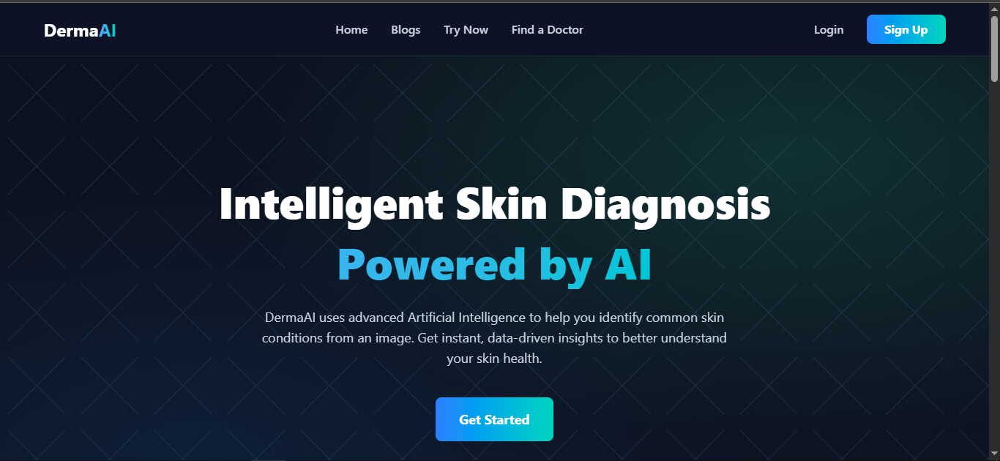       | 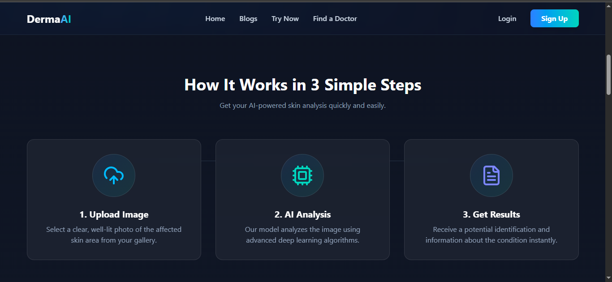       | 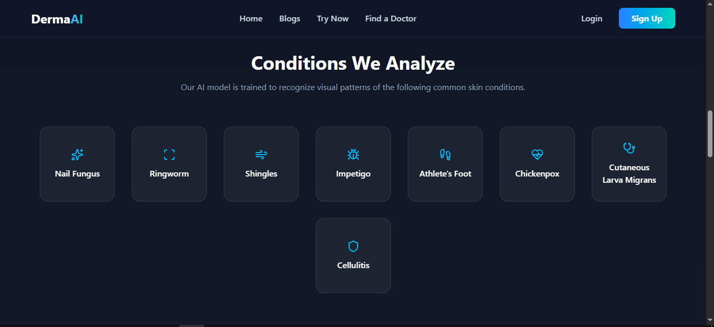       |
| **Home 4** | **Home 5** | **Home 6** |
| 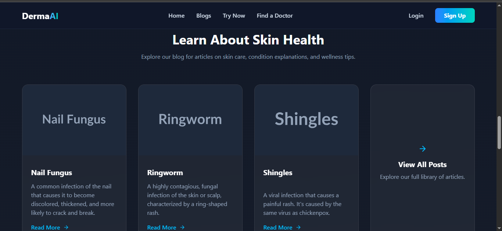       | 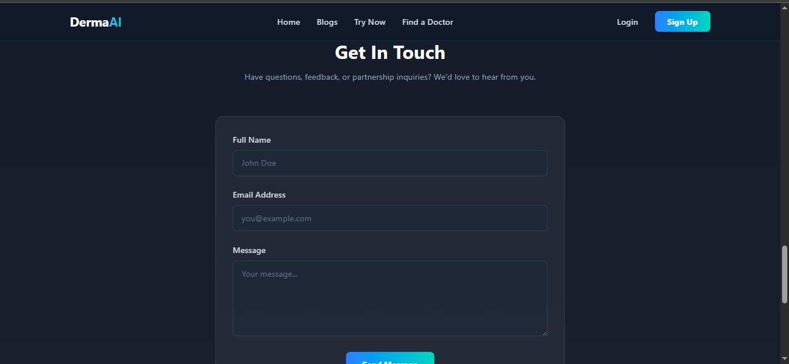       | 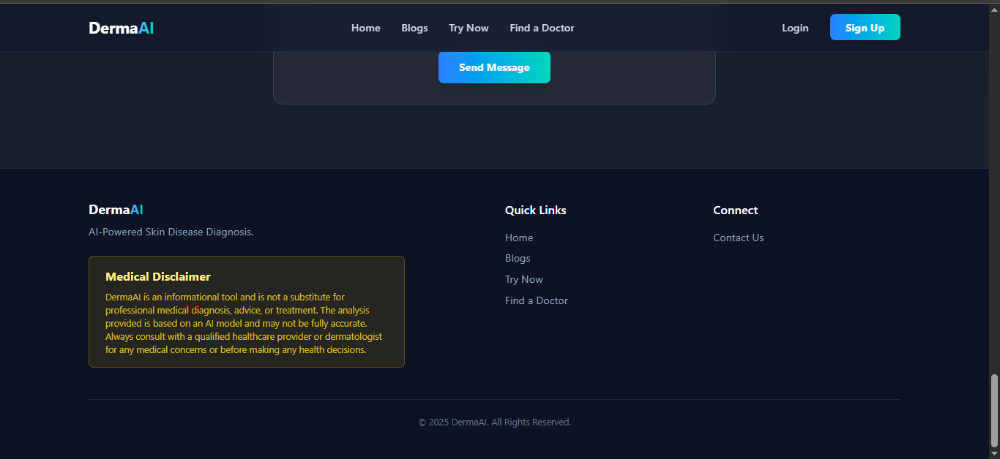       |

### Authentication Flow
| Login Page                           | Signup Page                            | Email Verification                       |              
| :----------------------------------- | :------------------------------------- | :--------------------------------------- |
| 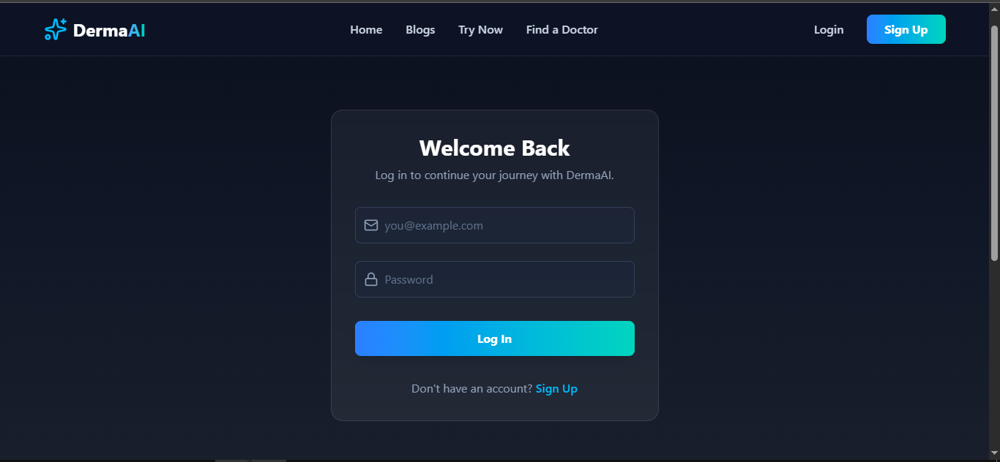         | 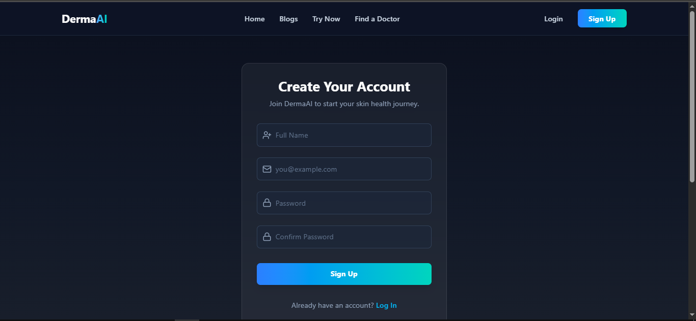       | 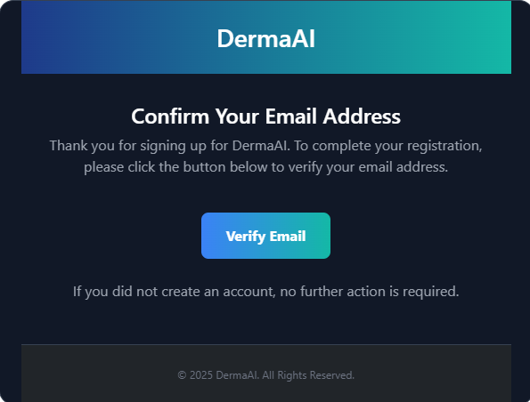      |

| Email Verification                        |     Email Unverified                          |
| :-----------------------------------      | :-------------------------------------        |
| 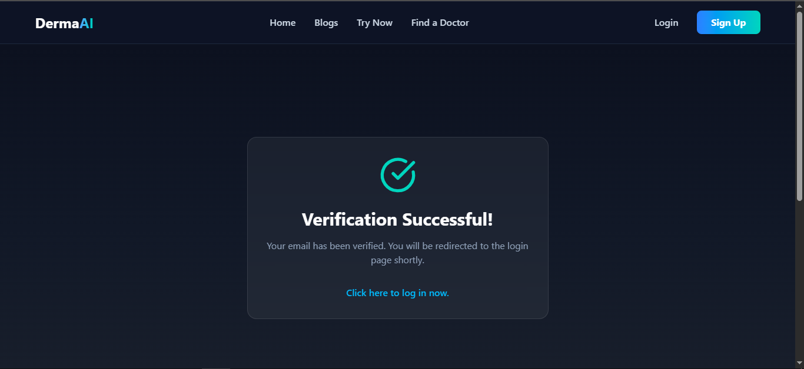 | 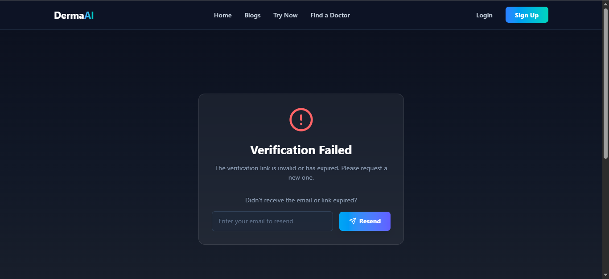       |

### User & Guest Views
| Dashboard 1                          | Dashboard 2                            | Find a Doctor                            |
| :----------------------------------- | :------------------------------------- | :--------------------------------------- |
|  | 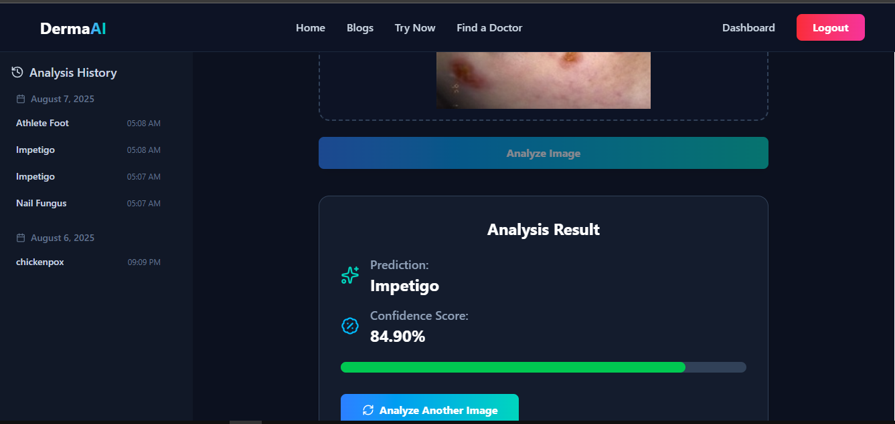 | 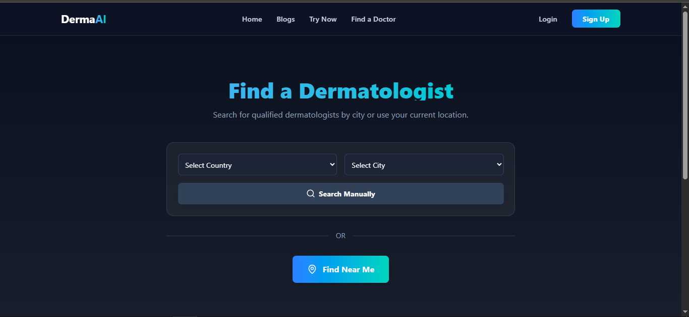     |
| **Guest View 1** | **Guest View 2** | **Guest View 3** |
| 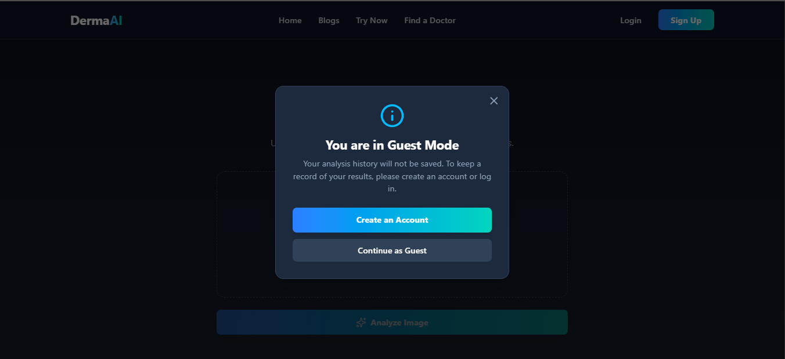     | 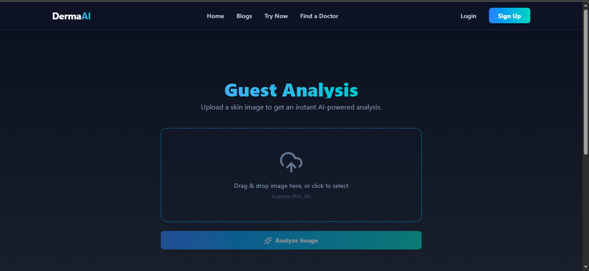       | 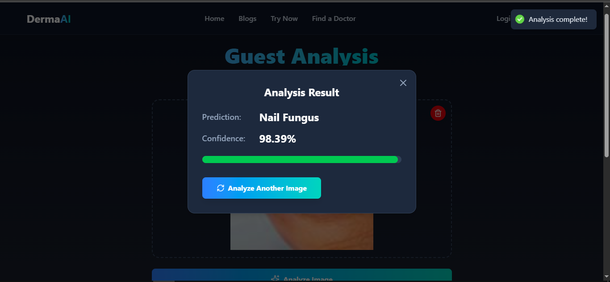         |

### Content & Other Pages
| Blog Page 1                          | Blog Page 2                            | Not Found Page                           |
| :----------------------------------- | :------------------------------------- | :--------------------------------------- |
| 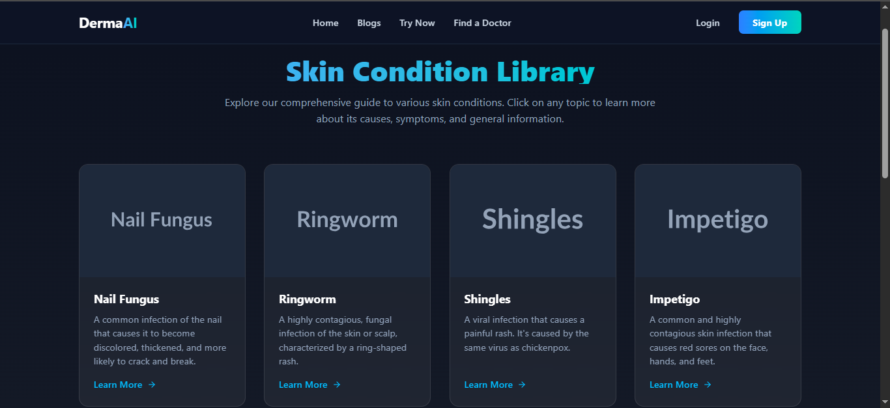       |          | 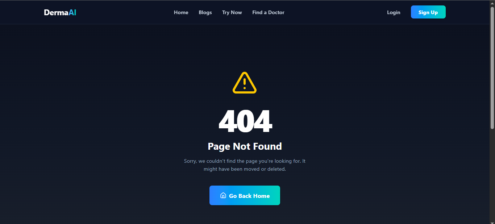 |

---

## 🚀 Installation and Setup

To get a local copy up and running, follow these steps. This project is split into a `backend` and `frontend` directory.

### Prerequisites
* Python 3.8+
* Node.js v14+
* NPM or Yarn

### 1. Clone the Repository
```bash
git clone https://github.com/MHuzaifaHussain/DermaAI.git
cd dermaAI
```

### 2. Backend Setup (FastAPI)
```bash
# Navigate to the backend directory
cd backend

# Create a virtual environment
python -m venv venv
source venv/bin/activate  # On Windows use `venv\Scripts\activate`

# Install required Python packages
pip install -r requirements.txt

# Run the backend server
uvicorn main:app --reload
```
The backend API will be running on `http://127.0.0.1:8000`.

### 3. Frontend Setup (React)
```bash
# Navigate to the frontend directory from the root folder
cd frontend

# Install NPM packages
npm install

# Start the application
npm start
```


333 4. run CMD file
run run.cmd.
The React development server will open at `http://localhost:3000`.
